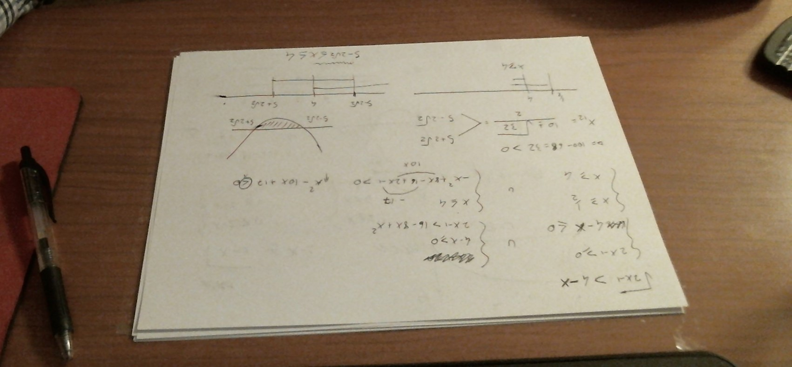
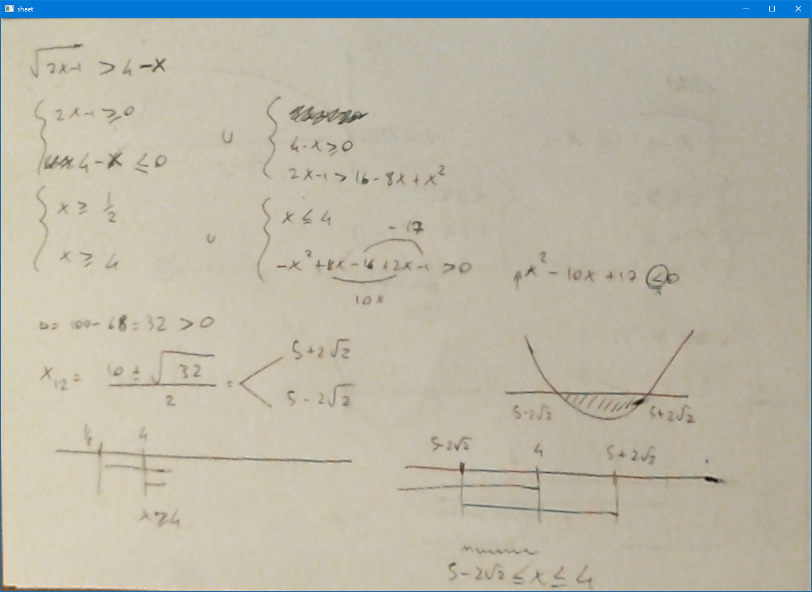

# Sheet

Pubblico questo script nel caso qualcun altro, come me, si trovasse nella necessità di dover dare ripetizioni a distanza e non sia dotato di un tablet o pc convertibile:
L'idea è di inquadrare il foglio con la webcam e raddrizzare via software l'effetto di prospettiva (come fa Office Lens ad esempio).

Il programma apre una finestra in cui mostra il video della webcam, bisogna cliccare sui vertici del foglio per dargli la posizione 
partendo dall'angolo in alto a sinistra (_dal vostro punto di vista_, non da quello della webcam) poi quello in alto a destra, poi quello in basso a sinistra, poi quello in basso a destra
A quel punto si aprirà una nuova finestra con il foglio raddrizzato, da poter mostrare all'altra persona tramite screen sharing

## Esempio:

 

